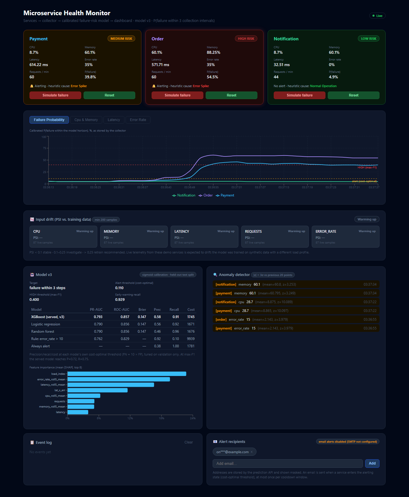
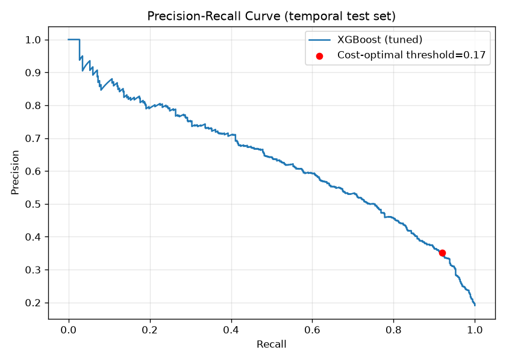
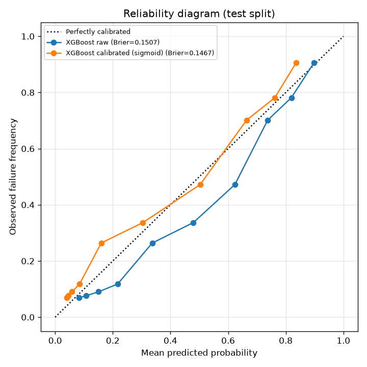
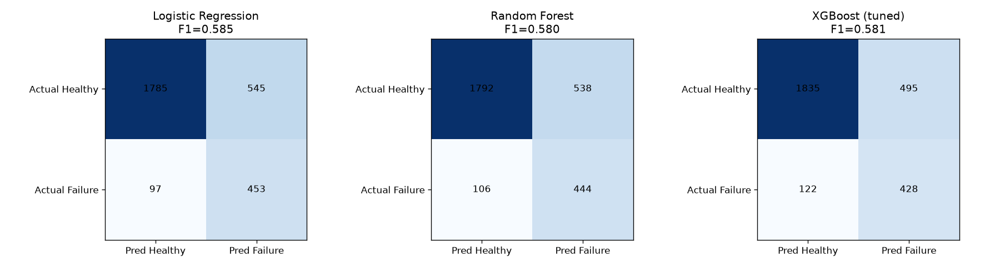
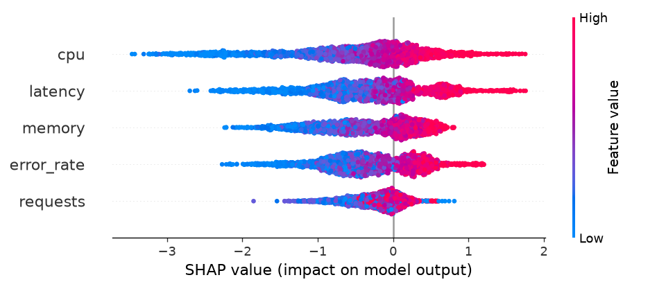

# Microservice Health Monitoring & Failure Prediction

Three FastAPI microservices form a real call chain. A collector probes and scrapes them, stores
telemetry in SQLite, and asks a **calibrated XGBoost model** for the probability that each service
fails within the next 3 collection intervals. A React dashboard (behind Nginx) shows live and historical
risk, input drift (PSI), anomalies and alerting state. Everything runs with one `docker compose up`.

The project is built to be honest about what it shows. The model is trained on **synthetic**
telemetry, it is compared against trivial baselines, every number in this README is copied from
`artifacts/v3/metadata.json` or `docs/benchmark.json` (regenerated by the pipeline, never typed by hand), and
the [iteration story](#iteration-story) lists the bugs found in earlier versions.



*Live run with a failure injected into `order`: `order` is HIGH risk, its upstream `payment` is MEDIUM (its
calls to `order` are slow and failing), and `notification` stays LOW. Probabilities are the ones the collector
stored; dashed lines are the alert (cost-optimal) and HIGH (max-F1) thresholds from the model metadata.*

---

## Results at a glance

Held-out **test split** (last 20% of time, 2,880 rows, 38.2% positives), never used for tuning or
threshold selection. The target is "service fails at any of the next 3 steps".

| Model | PR-AUC | ROC-AUC | Brier | Precision | Recall | Alert rate | Cost (10·FN + FP) |
|---|---|---|---|---|---|---|---|
| **XGBoost, calibrated (served)** | **0.7935** | **0.8573** | **0.1467** | 0.579 | 0.907 | 0.598 | 1745 |
| Logistic regression, calibrated | 0.7896 | 0.8560 | 0.1473 | 0.561 | 0.920 | 0.626 | **1671** |
| Random forest, calibrated | 0.7903 | 0.8560 | 0.1473 | 0.464 | 0.958 | 0.788 | 1676 |
| Rule: `error_rate > 10` | 0.7622¹ | 0.8293¹ | — | 0.922 | 0.097 | 0.040 | 9939 |
| Always alert | — | — | — | 0.382 | 1.000 | 1.000 | 1781 |
| Never alert | — | — | — | — | 0.000 | 0.000 | 10990 |

Precision, recall and cost are measured at each model's own cost-optimal threshold, tuned on the validation split.
¹ Uses raw `error_rate` as the ranking score. PR-AUC of a random ranker equals prevalence, which is 0.382.

**How to read this honestly:**

- **XGBoost does not meaningfully beat logistic regression.** It is ahead by 0.004 PR-AUC with no
  confidence interval, and LR has the lower cost at its operating point. That is expected here: the synthetic
  failure process is a logistic function of the raw metrics, which is exactly LR's model family. XGBoost is still
  the served model because it is never worse on threshold-free metrics, it can represent the threshold-like
  interactions real telemetry tends to have, and it ships with native JSON serialization plus exact TreeSHAP. On
  this dataset LR would be an equally valid, simpler choice, and swapping models would only touch
  `api/model_loader.py`.
- **The cost-optimal operating point is barely better than "always alert".** It costs 1745 vs 1781, because a
  10:1 FN:FP cost with 38% prevalence makes alerting on about 60% of steps optimal. The 10:1 ratio is an
  assumption. The **max-F1 threshold (0.40)** is the more useful operating point: precision 0.717, recall 0.748,
  F1 0.732, alerting on 39.8% of steps. That threshold drives the HIGH band.
- **Early warning:** among 323 failure onsets in the test split, the alert threshold fired in the 3 steps
  before onset for 92.9% of them, with a mean lead of 2.93 steps (8.8 min at 3-min steps). At the max-F1
  threshold it is 77.4% with a 2.85-step lead. The lead time is capped at K = 3 by construction, and a high
  alert rate makes early-warning recall easy, so read it together with the alert rate.
- **Calibration** (sigmoid, fit on validation) lowers test Brier from 0.1507 to 0.1467. Validation prevalence
  (32.9%) is lower than test (38.2%), so calibrated probabilities slightly under-predict on test. This is
  visible in the reliability plot.

| Plot | |
|---|---|
|  |  |
|  |  |

Per-service test metrics for the served model: PR-AUC / ROC-AUC are payment 0.7939 / 0.8588,
order 0.7726 / 0.8358, notification 0.8168 / 0.8783. The top features by mean |SHAP| are `load_index`,
`error_rate_roll5_mean`, `latency_roll5_mean`, `lat_x_err` and `cpu_roll5_mean`.

---

## Architecture

```
                      ┌──────────────────────── docker compose ────────────────────────┐
                      │                                                                │
  Browser ──► Nginx (dashboard :5173)                                                  │
                      │   GET  /collector/*  ─────────────────────────┐                │
                      │   GET  /api/{model-info,drift,...} ──┐        │                │
                      │   POST /api/{svc}/simulate_failure   │        │                │
                      │        (+X-API-Key injected)         │        │                │
                      │                                      ▼        ▼                │
                      │                         Prediction API   Collector (:8005)     │
                      │                         (:8004)          ├─ every 5 s:         │
                      │                         artifacts/v3     │   1. probe payment /process
                      │                         Booster + calib. │   2. scrape /metrics x3
                      │                         PSI drift window │   3. z-score anomalies
                      │                              ▲           │   4. POST /predict/batch ──┐
                      │                              └───────────┼─────────(X-API-Key)──────┘
                      │                                          │   5. PSI snapshot (5 min)
                      │                                          ▼                     │
                      │                                    SQLite (WAL, volume)        │
                      │                                    metrics · predictions ·     │
                      │                                    anomalies · drift · events  │
                      │                                                                │
                      │   payment (:8001) ──/process──► order (:8002) ──► notification (:8003)
                      │   one image, SERVICE_NAME env; X-Request-ID forwarded down the chain
                      └────────────────────────────────────────────────────────────────┘
```

- The **collector is the only caller** of `/predict/batch`, and the only writer to SQLite. The dashboard never
  calls the model; it reads the predictions the collector stored. Nginx does not expose `/predict` at all.
- Each prediction request carries the observation timestamp, so `/predict/batch` is **idempotent** per
  `(service, timestamp)`. A retried request does not push a duplicate point into the rolling-feature buffer.
- On startup the API **seeds its per-service feature buffers from collector history** in a background
  thread, so a restart does not reset rolling features to a single point.

---

## Quick start

Requires Docker with Compose v2.

```bash
cp .env.example .env        # optional: set API_KEY / SMTP; defaults work for a local demo
docker compose up -d --build
```

| URL | What |
|---|---|
| http://localhost:5173 | Dashboard |
| http://localhost:8004/docs | Prediction API (Swagger) |
| http://localhost:8005/docs | Collector API (Swagger) |
| http://localhost:8001/docs … 8003 | Simulated services |

Click **Simulate failure** on a service card and watch its risk, and its upstream's risk, rise within a few
cycles. `docker compose down` stops everything; `docker compose down -v` also deletes the SQLite volumes.

Local development without Docker, retraining, tests and benchmarks are described in
[`run_command.txt`](run_command.txt) (Windows PowerShell and Linux/macOS) and the `Makefile`.

---

## ML pipeline

`python -m model.generate_data --check` then `python -m model.train` (from the repo root).

| Step | What and why |
|---|---|
| **Data** | 14,400 rows: 10 days × 3 services × one point every 3 min. Load follows a daily cycle, mean-reverting AR(1) noise and decaying incident spikes; failure at each step is a Bernoulli draw from a logistic function of the metrics (17.5% per step). One seeded RNG; `--check` verifies an identical md5 across two runs (`f3efbf80f92bf3d8e22113029bda2e08`, also asserted in CI against the artifact metadata). |
| **Target** | `y_t = 1` if the service fails at any of steps `t+1 … t+K` (K = 3). This is forecasting, not detection of the current state. The last K rows per service are dropped because their horizon is incomplete. |
| **Features** | 23 features from `common/features.py`: 5 raw metrics, plus a 5-step rolling mean, rolling std (`ddof=0`, pinned) and first difference for each, plus `cpu×mem`, `latency×error_rate` and `requests×latency/1000`. **The same function** is used in training and serving; a parity test streams rows through the serving buffer and compares the result with batch features. |
| **Splits** | By timestamp, all services together: train 9,774 rows (Jun 1 – Jun 7) → validation 1,719 (Jun 7 – Jun 8, last 15% of the train period) → test 2,880 (Jun 8 – Jun 10, last 20%). A **K-step purge gap** before each boundary stops training labels from looking into the next split. |
| **Tuning** | `RandomizedSearchCV` (20 candidates) with `TimeSeriesSplit` over **unique timestamps** (gap = K), scored on average precision. Best CV AP is 0.7344. |
| **Calibration** | `CalibratedClassifierCV(FrozenEstimator(model), method="sigmoid")` fit on validation, for every model. Sigmoid has 2 parameters, chosen over isotonic to limit overfitting, because the same validation split is then used to pick thresholds. |
| **Thresholds** | On calibrated **validation** probabilities only: cost-optimal (min 10·FN + FP) = **0.11** drives alerts and email; max-F1 = **0.40** marks the HIGH band. Bands: LOW < 0.11 ≤ MEDIUM < 0.40 ≤ HIGH. |
| **Artifacts** | `artifacts/v3/`: `model.json` (XGBoost native format), `metadata.json` (thresholds, bands, calibration parameters, feature list, all metrics, git SHA, clean-tree flag, dataset md5, library versions, golden rows), `drift_reference.json` (PSI bins from the training split) and plots. Training is deterministic: re-running reproduces `model.json` byte-for-byte. |

**Serving safety checks:** the API refuses to load an artifact whose feature list differs from
`common/features.py`, and it re-scores golden rows stored at training time on every load. Any mismatch above
1e-5 (for example, edited calibration parameters) makes `/health` return 503 instead of serving skewed
predictions.

**Drift:** PSI per raw metric compares the live window (last 500 inputs) with training-split quantile bins,
using open-ended outer bins. The collector stores a snapshot every 5 minutes and logs a single
`retrain_recommended` event when max PSI rises above 0.25. Live telemetry from the demo services *will*
drift, because the model was trained on a different synthetic load profile. That is the expected
behaviour for the monitor to surface.

---

## Benchmarks

`python -m scripts.benchmark` produces `docs/benchmark.json`. The numbers below come from that file, measured on
Windows 11 with an Intel CPU (20 logical cores) and Python 3.11.16. These are local, single-process
micro-benchmarks, not load tests.

| Operation | p50 | p95 |
|---|---|---|
| One prediction: shared feature engineering + calibrated Booster | 6.84 ms | 9.22 ms |
| `POST /predict/batch`, 3 services, in-process HTTP stack (TestClient) | 30.7 ms | 31.5 ms |
| Collector `/history` query, one service, 100 rows | 1.86 ms | 2.08 ms |
| Collector `/history` query, all services, 2,000 rows | 12.3 ms | 13.2 ms |
| Collector latest prediction per service | 1.34 ms | 1.70 ms |

The SQLite queries run on a database sized for the full 7-day retention: 362,880 metric rows plus 362,880
prediction rows, 120 MB. The benchmark drove two fixes:

- "Latest prediction per service" was a `GROUP BY MAX(timestamp)` full scan at **53.4 ms** p50. It became
  three indexed `ORDER BY timestamp DESC LIMIT 1` lookups at **1.34 ms**.
- Inference switched from `DMatrix` construction to `Booster.inplace_predict`, saving about 2 ms.

Most of the remaining time is pandas feature engineering (about 5 ms). It was kept on purpose: one
implementation shared by training and serving is worth more than a faster duplicate that could drift.

---

## Design decisions

- **Collector as the single writer and single caller of the model.** Predictions are stored next to the
  metrics they were made from, so history, the dashboard and any later evaluation all see the same numbers.
  In v2 the dashboard computed its own fake "probability" for historical points.
- **Shared code instead of shared conventions.** Features, calibration, risk bands and PSI live in `common/`,
  which both training and serving import. A single place defines `ddof`, the window size and the band edges.
- **No pickles across the train/serve boundary.** The served artifact is XGBoost's JSON plus plain-JSON
  calibration parameters. The API image installs neither scikit-learn nor SciPy, and uses the CPU-only
  `xgboost-cpu` wheel.
- **Two thresholds, two jobs.** The cost-optimal threshold decides whether to page someone; max-F1 decides what
  is shown as HIGH. Both come from metadata, so retraining can never leave a hard-coded number behind.
- **Fail closed.** If `API_KEY` is unset, mutating endpoints return 503. If SMTP settings are incomplete, alerts
  are disabled and `/health` says why. If the artifact is missing or skewed, `/health` returns 503.
- **Real call chain, measured metrics.** `latency`, `error_rate` and `requests` in `/metrics` are measured from
  `/process` traffic. The collector's end-to-end probes provide that traffic, and `/metrics`, `/health` and
  `/traces` are excluded so that monitoring does not measure itself. Failure injection adds real latency and real
  5xx errors, so cascading failures show up upstream on their own.
- **SQLite with WAL.** At 3 services × one row per 5 s (51,840 metric rows a day), one writer thread plus
  concurrent readers is well within SQLite's range, and the benchmark shows p95 query latency under 15 ms at full
  retention. Timestamps are fixed-width UTC `YYYY-MM-DDTHH:MM:SSZ`, compared as strings in one format.
  Retention cleanup runs hourly with a WAL checkpoint. `VACUUM` runs daily rather than after every cleanup,
  because it rewrites the whole file and blocks the writer, and SQLite reuses freed pages anyway.
- **Anomaly detection** is a z-score against the *previous* 20 values; v2 included the point in its own
  baseline. The threshold is 3σ, configurable. At 2σ it flagged most rows in a live run.
- **Nginx is the browser's trust boundary.** It exposes an allow-list of routes and methods, adds the demo
  `X-API-Key` server-side for the few mutating routes the dashboard needs, and sets CSP, nosniff and
  frame-deny headers plus gzip. The key never ships in the JS bundle.

---

## Limitations

- **Synthetic training data.** The failure label is generated from the same metrics the model sees, so the
  results show that the pipeline is correct, not that it predicts real outages. The generator's logistic form
  also favours logistic regression.
- **Live predictions are a demo.** The running services' telemetry (CPU near idle, latencies around 30–600 ms,
  about 60 requests/min) is far from the training distribution, and PSI is expected to flag it.
- **psutil inside containers sees the shared host/VM.** All three services report nearly the same CPU and
  memory. In failure mode a synthetic CPU/memory overlay is added, because a container cannot raise host
  utilisation on demand. Latency and errors in failure mode are real.
- **Single-worker state.** The API keeps feature buffers, the drift window and alert de-duplication in
  process, so it must run with one worker. Buffers are re-seeded from the collector after a restart; the drift
  window is not and starts warming up again. Scaling out would need shared state (for example Redis), or the
  collector sending the feature window with each request.
- **Statistical caveats.** There are no confidence intervals, so the XGBoost vs LR gap is within noise.
  Calibration and threshold selection share the validation split (1,719 rows). Validation and test
  prevalence differ (32.9% vs 38.2%). Lead time is capped at K = 3 by the label definition.
- **The cost ratio is an assumption.** With FN = 10 × FP the alert threshold fires on about 60% of steps;
  a real deployment would set the ratio with the on-call team and probably add an alert budget.
- **The root cause** shown next to a prediction is a fixed rule (memory > 90 → "Memory Saturation" …), not
  learned attribution. Per-prediction SHAP would be the principled replacement.
- **The demo API key** injected by Nginx means anyone who can reach the dashboard can trigger failure
  injection or edit recipients. Production would put real user auth (SSO) in front.

---

## Iteration story

**v1: a model that was "100% accurate".** The training data came from two disjoint operating modes: a
healthy baseline and a hard-coded `/simulate_failure` state. `error_rate` alone separated the classes
perfectly. The model was learning the data-collection procedure, not failure.

**v2: realistic data, but a review found real bugs.** v2 added overlapping synthetic data, baselines, a
temporal split, PR curves, SHAP and PSI. A full review then found:

1. **The swapped max-F1 assignment** (`max_f1_val, best_f1_th = float(thr), f1_val`) meant the saved "threshold"
   was actually an F1 score, and the API used it as the decision threshold.
2. **Thresholds were tuned on the test set**, so the reported thresholded metrics were optimistic.
3. **`StratifiedKFold(shuffle=True)`** in hyper-parameter search, on time-series data.
4. **The label was the same-step failure flag.** That is detection, not prediction.
5. **Train/serve skew:** rolling std used `ddof=1` in training (pandas) and `ddof=0` in the API (numpy).
6. **Results that could not be reproduced.** The README's F1 (0.745) did not match `model_meta_v2.json`
   (0.585), and the committed generator did not reproduce the committed CSV: it produced a 42.8% failure
   rate against 18.1% in the data. The original coefficients could not be recovered exactly, so v3 sets the
   intercept that best matches the old labels (96% agreement, 17.5% failure rate) and documents it in the code.
7. **PSI ignored out-of-range values.** `np.histogram` with training min/max edges dropped them.
8. **Dashboard and collector:** the dashboard called the model itself and drew a hand-made formula as
   "probability" for historical points, its polling captured stale state, and the collector's retention
   cleanup compared local `T`-separated timestamps with SQLite's UTC space-separated ones.
9. **Security hygiene:** real email addresses were used as defaults, CORS allowed `*` with credentials, and
   there was no auth on mutating endpoints.

**v3: this version.** Every item above is fixed and covered by a test where possible (see
`tests/test_ml_logic.py`). The target is forward-looking with a purged time split, and tuning, calibration and
thresholds use validation data only. Artifacts are reproducible with provenance, and the API self-checks
artifacts on load. The collector owns predictions and the dashboard reads them. Everything was verified by
running the full stack in Docker; that run caught one more bug, an Nginx template variable that was not
passed to the container. The cost of all this honesty: the headline number went from "100% accuracy" to a
PR-AUC of 0.79 that ties logistic regression.

---

## Testing and CI

`pytest` runs 50 tests:

- `test_features.py`: train/serve feature parity, `ddof`, buffer bounds.
- `test_api.py`: known-input predictions against a direct model call, risk bands, schema validation, batch
  cap, unknown services, idempotency, X-API-Key on every mutating endpoint, fail-closed auth, CORS, email
  validation and persistence, email de-duplication, a tampered artifact rejected by the self-check.
- `test_services.py`: measured metrics, excluded monitoring paths, request-id propagation with a mocked
  downstream, failure injection.
- `test_collector.py`: temporary SQLite DB, UTC cut-offs, history and prediction joins, the anomaly
  baseline, one full cycle with fakes asserting the collector is the only batch caller, one retrain event
  per drift episode.
- `test_ml_logic.py`: PSI against a hand computation, threshold-swap regression, label and split invariants,
  lead time.

GitHub Actions (`.github/workflows/ci.yml`) runs ruff lint and format, pytest, the dataset reproducibility
check against `artifacts/v3`, dashboard ESLint and `vite build`, and `docker compose build`.

---

## API reference

**Prediction API (:8004).** Mutating endpoints require `X-API-Key`.

| Method | Path | |
|---|---|---|
| GET | `/health` | Model loaded and version, self-check, alerts enabled (and why not), buffer seeding. 503 if no model. |
| GET | `/model-info` | Version, thresholds, bands, test metrics, baselines, splits, provenance |
| GET | `/feature-importance` | Mean \|SHAP\| (falls back to gain) |
| GET | `/drift` | PSI per feature, `retrain_recommended` |
| POST 🔑 | `/predict`, `/predict/batch` | `{service, metrics, timestamp?}`; batch ≤ 10, services allow-listed |
| GET | `/alert-config` | Recipients (masked), alerts enabled, cooldown |
| POST / DELETE / PUT 🔑 | `/alert-config/recipients[/{id}]` | `EmailStr`-validated, persisted in SQLite |
| POST 🔑 | `/alert/test` | 409 if SMTP is not configured |

**Collector (:8005):** `GET /health`, `/history?service=&limit=` (metrics joined with predictions),
`/predictions/latest`, `/anomalies`, `/drift/snapshots`, `/events`, `/summary`, `/db-stats`;
`POST /cleanup` 🔑.

**Services (:8001–8003):** `POST /process` (the call chain), `GET /metrics`, `/health` (with a real
downstream check), `/livez`, `/traces`; `POST /simulate_failure` 🔑, `/reset` 🔑.

---

## Project structure

```
common/            shared by training and serving: features, calibration, risk bands, PSI, JSON logging
model/             generate_data.py (seeded synthetic telemetry), train.py (pipeline -> artifacts/vN)
artifacts/v3/      model.json, metadata.json, drift_reference.json, plots
api/               prediction API: app.py, model_loader.py, alerts.py, config.py, Dockerfile
collector/         collector loop + read API (collector.py) and SQLite layer (db.py)
services/          one microservice codebase, run as payment / order / notification
dashboard/         React 19 + Vite + Recharts; nginx.conf.template; Dockerfile
tests/             pytest suite
scripts/           benchmark.py
docs/              figures used in this README, benchmark.json
```

---

## Future work

- Bootstrap confidence intervals for every metric, and a significance test between XGBoost and LR.
- Event-based labels (incident onset), longer and multiple horizons, and alert budgets in the threshold objective.
- Train and evaluate on real telemetry and incident data; per-service or hierarchical models.
- Move in-process serving state to Redis to allow multiple API workers.
- OpenTelemetry tracing and a Prometheus `/metrics` exposition in place of the hand-rolled request ids.
- A model registry with shadow deployment of v{N+1} against v{N} on live traffic.

## License

MIT

## Author

**Gulshan Kumar**: an ML + distributed-systems project on failure prediction, observability and alerting.
