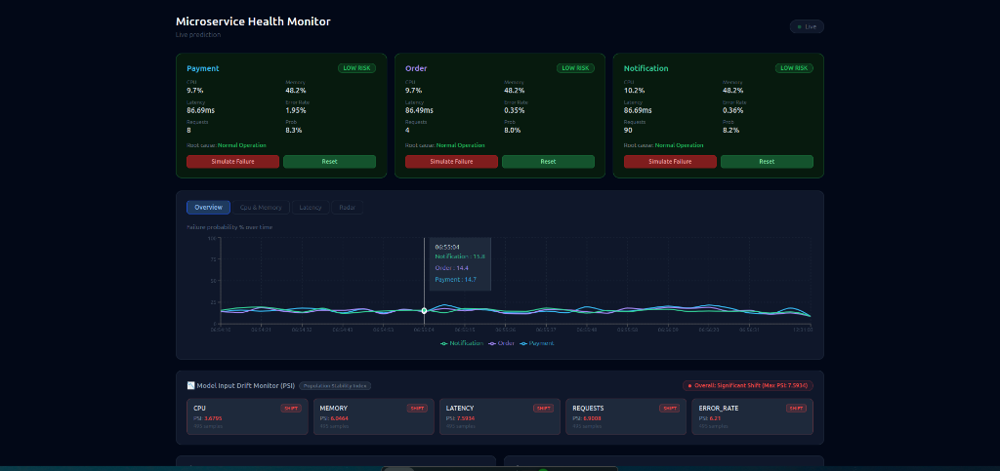
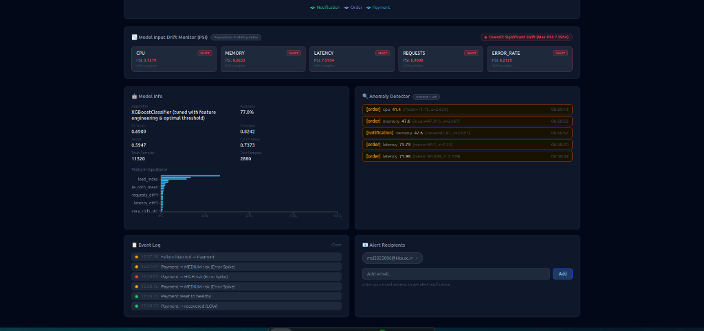

# Microservice Failure Prediction System

A production-grade microservice observability platform with ML-powered failure prediction, real-time health monitoring, statistical anomaly detection, persistent metric storage, and automated alert emails.


---

## Overview

This project simulates a production microservices environment and applies machine learning to predict service failures before they happen. Three independent FastAPI microservices (Payment, Order, Notification) expose real OS telemetry via `psutil` — actual CPU, memory usage, and measured request latency — that is collected every 5 seconds, written to a SQLite time-series database, fed into a trained XGBoost classifier, and visualised on a live React dashboard with automatic alert escalation and email notifications.

The system answers a real engineering question: **given current CPU, memory, latency, request rate, and error rate — will this service fail in the next observation window?**

---

## Dashboard Screenshots


*Live Microservice Telemetry Cards, Failure Probability Trendlines, and Population Stability Index (PSI) Input Drift Monitor.*


*Tuned Model Evaluation Metrics, Feature Importance Breakdown, Z-Score Anomaly Feed, Live Event Log, and Alert Recipient Manager.*

---

## Architecture

```
┌──────────────────────────────────────────────────────────────────────┐
│                        React Dashboard  :5173                        │
│    Live cards · 4 chart views · Model info · Anomaly feed · Alerts  │
└──────────────┬──────────────────────────────┬────────────────────────┘
               │  Vite proxy                  │  Vite proxy
               ▼                              ▼
┌──────────────────────────┐    ┌─────────────────────────────┐
│   Prediction API  :8004  │    │   Collector API     :8005   │
│                          │    │                             │
│  POST /predict           │    │  GET  /history              │
│  POST /predict/batch     │    │  GET  /anomalies            │
│  GET  /feature-importance│    │  GET  /summary              │
│  GET  /model-info        │    │  GET  /db-stats             │
│  GET  /drift (PSI)       │    │  POST /cleanup              │
│  GET  /alert-config      │    │                             │
│  POST /alert/test        │    │  SQLite: metrics.db         │
│  (XGBoost .pkl)          │    │                             │
└──────────────────────────┘    └──────────────┬──────────────┘
                                               │ polls every 5s
               ┌───────────────────────────────┼──────────────────┐
               │                               │                  │
               ▼                               ▼                  ▼
  ┌────────────────────┐      ┌─────────────────────┐    ┌──────────────────────┐
  │  Payment  svc :8001│      │  Order svc    :8002  │    │  Notification  :8003 │
  │                    │      │                      │    │                      │
  │  GET  /metrics     │      │  GET  /metrics       │    │  GET  /metrics       │
  │  GET  /health      │      │  GET  /health        │    │  GET  /health        │
  │  GET  /traces      │      │  GET  /traces        │    │  GET  /traces        │
  │  POST /simulate_   │      │  POST /simulate_     │    │  POST /simulate_     │
  │        failure     │      │        failure       │    │        failure       │
  │  POST /reset       │      │  POST /reset         │    │  POST /reset         │
  │                    │      │                      │    │                      │
  │  psutil: real OS   │      │  psutil: real OS     │    │  psutil: real OS     │
  │  metrics + tracing │      │  metrics + tracing   │    │  metrics + tracing   │
  └────────────────────┘      └─────────────────────┘    └──────────────────────┘
```

**Request flow:**
1. Dashboard polls `/metrics` on each service every 5 seconds
2. Raw metrics are sent as a single batch to `/predict/batch` on the Prediction API
3. XGBoost model returns failure probability, risk level (LOW / MEDIUM / HIGH), and root cause for all 3 services in one call
4. If risk crosses MEDIUM/HIGH threshold, email alert fires in a background task
5. Dashboard updates service cards, rolling charts, anomaly feed, and event log
6. Collector independently writes all metrics to SQLite every 5 seconds
7. Dashboard loads last 30 data points from SQLite on mount so charts are never empty
8. Collector runs z-score anomaly detection on a rolling 20-point window per metric

---

## Tech Stack

| Layer | Technology | Why this choice |
|---|---|---|
| Microservices | FastAPI + Uvicorn | Async, fast, auto OpenAPI docs |
| Real telemetry | psutil | Actual OS CPU/memory instead of random numbers |
| Request tracing | UUID middleware | X-Request-ID propagation like Google Dapper |
| ML Model | XGBoost Classifier | Handles non-linear feature interactions; built-in feature importance |
| ML Pipeline | scikit-learn, pandas, joblib | Training, evaluation, serialisation |
| Time-series DB | SQLite | Zero-dependency persistent storage with indexed queries |
| Anomaly detection | Z-score (rolling window) | Statistically principled, no extra dependencies |
| Dashboard | React 19 + Recharts | Live visualisation with 4 chart views |
| HTTP Client | Axios | Promise-based, interceptor support |
| Build Tool | Vite | Fast HMR dev server with API proxy |
| Containerisation | Docker + Docker Compose | One-command startup, healthchecks, depends_on |
| Email alerts | smtplib + MIME | SMTP background tasks, no blocking |
| Collector API | FastAPI on :8005 | History, anomalies, db-stats endpoints |

---

## ML Model

### Why XGBoost?

XGBoost was chosen over logistic regression and random forest for the following reasons:

- **Non-linear feature interactions** — failure signals emerge from combinations of metrics (high CPU *and* high latency together are more predictive than either alone). Logistic regression cannot capture this without manual feature engineering.
- **Handles class imbalance** — the dataset has ~20% failure samples. XGBoost's gradient boosting naturally up-weights minority class errors.
- **Interpretable feature importance** — exposes `feature_importances_` which directly powers root cause analysis in the API.
- **Fast inference** — sub-millisecond prediction latency for real-time monitoring.
- **No feature scaling needed** — unlike SVM or KNN, tree-based models are scale-invariant.

### Risk Thresholds

```python
if probability >= 0.8:    risk = "HIGH"    # immediate action required
elif probability >= 0.5:  risk = "MEDIUM"  # investigation recommended
else:                     risk = "LOW"     # normal operation
```

### Root Cause Analysis

```
memory   > 90%     →  Memory Saturation
cpu      > 90%     →  CPU Overload
error_rate > 10%   →  Error Spike
latency  > 1000ms  →  Latency Surge
else               →  Normal Operation
```

---

## Features

- **Real OS telemetry** — psutil CPU/memory instead of random numbers; latency from measured request duration
- **Distributed request tracing** — `X-Request-ID` UUID generated on entry, propagated in response headers, logged per service (inspired by Google Dapper)
- **Live metric polling** — dashboard fetches all 3 services every 5 seconds
- **Batch ML inference** — single `/predict/batch` call replaces 3 separate predict calls
- **Persistent time-series** — SQLite stores all metrics; charts pre-populate from history on page load
- **Statistical anomaly detection** — z-score on rolling 20-point window per metric per service
- **Flashing alert banner** — fires when any service crosses MEDIUM risk threshold
- **Automated email alerts** — HTML email with metrics table sent via SMTP on risk escalation
- **Smart alert deduplication** — email only fires when risk *changes*, not on every 5s poll
- **Auto DB cleanup** — rows older than 7 days deleted hourly; VACUUM reclaims disk space
- **4 chart views** — failure probability history, CPU/memory, latency, radar snapshot
- **Model info panel** — accuracy, F1, precision, recall, CV score fetched from `/model-info`
- **Feature importance chart** — bar chart from `/feature-importance` endpoint
- **Failure simulation** — inject failure state and reset via dashboard buttons
- **Full Docker Compose** — one command starts all 4 services with healthchecks and `depends_on`

---

## Project Structure

```
microservice-fail/
├── services/
│   ├── payment/           # FastAPI service — port 8001
│   │   ├── app.py         # psutil metrics, X-Request-ID tracing, /simulate_failure
│   │   ├── Dockerfile
│   │   └── requirements.txt
│   ├── order/             # FastAPI service — port 8002
│   └── notification/      # FastAPI service — port 8003
│
├── api/
│   ├── app.py             # Prediction API — port 8004
│   │                      # /predict/batch, /feature-importance, /model-info
│   │                      # /alert-config, /alert/test, SMTP email alerts
│   ├── failure_predictor.pkl
│   ├── model_meta.json    # accuracy, F1, confusion matrix (from train.py)
│   ├── Dockerfile
│   └── requirements.txt
│
├── model/
│   ├── train.py           # XGBoost training + full evaluation metrics
│   ├── test_model.py
│   ├── final_dataset.csv  # 1342 labeled samples
│   └── failure_predictor.pkl
│
├── collector/
│   ├── collector.py       # Scrapes metrics → SQLite + anomaly detection
│   │                      # FastAPI on :8005 for /history, /anomalies, /db-stats
│   ├── metrics.db         # SQLite time-series (auto-created)
│   └── requirements.txt
│
├── dashboard/
│   ├── src/
│   │   ├── App.jsx        # Live dashboard — charts, model info, anomaly feed
│   │   └── main.jsx
│   ├── vite.config.js     # Proxy routes to all 5 backend ports
│   └── package.json
│
└── docker-compose.yml     # All 4 services + healthchecks + depends_on
```

---

## Getting Started (Run from Scratch on Any System)

### Prerequisites

- **Docker & Docker Compose** (The only requirement to run the full platform!)
- *(Optional for local dev)* Python 3.10+, Node.js 18+

### Step 1: Clone the Repository

```bash
git clone https://github.com/Gulshan77350/Microservice-Health-Monitoring-system-and-Failure-Prediction.git
cd Microservice-Health-Monitoring-system-and-Failure-Prediction
```

### Step 2: Set Up Environment Variables (Optional for SMTP Alerts)

```bash
cp .env.example .env
```

### Step 3: Run the Full Platform with One Command

```bash
docker compose up -d --build
```

That's it! Within seconds, all 6 microservice containers will build, run automated health checks, and launch:

- 📊 **React Observability Dashboard**: [http://localhost:5173](http://localhost:5173)
- 🧠 **Failure Prediction API**: [http://localhost:8004](http://localhost:8004)
- 📈 **Metrics Collector & Anomaly Detector**: [http://localhost:8005](http://localhost:8005)
- 💳 **Payment Microservice**: [http://localhost:8001](http://localhost:8001)
- 📦 **Order Microservice**: [http://localhost:8002](http://localhost:8002)
- 🔔 **Notification Microservice**: [http://localhost:8003](http://localhost:8003)

### Stop & Free All Ports

```bash
docker compose down
```

---

## API Reference

### Prediction API (`localhost:8004`)

| Method | Endpoint | Description |
|---|---|---|
| GET | `/health` | API health + SMTP status |
| POST | `/predict` | Single service prediction |
| POST | `/predict/batch` | All services in one call |
| GET | `/feature-importance` | XGBoost feature importances |
| GET | `/model-info` | Algorithm, accuracy, F1, confusion matrix |
| GET | `/alert-config` | Current recipients + SMTP status |
| POST | `/alert-config/add` | Add email recipient |
| POST | `/alert-config/remove` | Remove email recipient |
| POST | `/alert-config/set` | Replace entire recipient list |
| POST | `/alert/test` | Send test email to all recipients |

**Swagger UI:** `http://localhost:8004/docs`

#### Example — batch predict

```bash
curl -X POST http://localhost:8004/predict/batch \
  -H "Content-Type: application/json" \
  -d '[
    {"service":"payment","metrics":{"cpu":75,"memory":68,"latency":320,"requests":1500,"error_rate":2.1}},
    {"service":"order","metrics":{"cpu":92,"memory":95,"latency":1800,"requests":8000,"error_rate":15.0}}
  ]'
```

```json
{
  "results": {
    "payment": {"prediction":0,"failure_probability":0.031,"risk":"LOW","root_cause":"Normal Operation"},
    "order":   {"prediction":1,"failure_probability":0.982,"risk":"HIGH","root_cause":"Error Spike"}
  },
  "count": 2
}
```

### Microservice endpoints (`localhost:8001–8003`)

| Method | Endpoint | Description |
|---|---|---|
| GET | `/metrics` | Real psutil CPU, memory, latency, requests, error_rate |
| GET | `/health` | Service name, version, uptime, dependencies |
| GET | `/traces` | Last 20 requests with X-Request-ID and duration |
| POST | `/simulate_failure` | Switch to failure mode (high-load metrics) |
| POST | `/reset` | Return to healthy state |

### Collector API (`localhost:8005`)

| Method | Endpoint | Description |
|---|---|---|
| GET | `/history?service=payment&limit=100` | Historical metrics from SQLite |
| GET | `/anomalies?limit=50` | Recent z-score anomaly detections |
| GET | `/summary` | Per-service averages (last 100 points) |
| GET | `/db-stats` | DB file size, row counts, retention info |
| POST | `/cleanup` | Manually delete rows older than retention window |
| GET | `/health` | Collector status + total row count |

**Swagger UI:** `http://localhost:8005/docs`

---

## Retrain the Model

```bash
cd model
python generate_realistic_data.py   # Writes final_dataset_v2.csv
python train_v2.py                  # Writes failure_predictor_v2.pkl, model_meta_v2.json,
                                     # pr_curve.png, shap_summary.png, confusion_matrices.png

# Copy updated artifacts to api/
cp failure_predictor_v2.pkl ../api/failure_predictor_v2.pkl
cp model_meta_v2.json         ../api/model_meta_v2.json
cp final_dataset_v2.csv       ../api/final_dataset_v2.csv

# Rebuild prediction API container
docker compose up -d --build prediction-api
```

---

## Design Decisions

**Why 3 separate microservices?**
To simulate realistic service mesh topology. Payment → Order → Notification represents a common e-commerce dependency chain where failures cascade.

**Why FastAPI over Flask?**
Async support, automatic OpenAPI docs, Pydantic validation, and `BackgroundTasks` for non-blocking email alerts — all without extra libraries.

**Why XGBoost over a neural network?**
For tabular, 5-feature data, gradient boosting consistently outperforms neural networks and is far more interpretable. Feature importance directly explains predictions.

**Why a separate Prediction API instead of embedding the model in each service?**
Separation of concerns — the ML model can be updated and redeployed independently. One model serves all services without duplication.

**Why SQLite over a dedicated time-series DB (InfluxDB/TimescaleDB)?**
Zero infrastructure overhead. At 5s polling × 3 services = 51,840 rows/day × 7 days = ~363K rows max, SQLite handles this with room to spare. An indexed `(service, timestamp)` query returns in under 5ms.

**Why Z-score anomaly detection over a threshold?**
Static thresholds (e.g. "CPU > 80%") require manual tuning and produce false positives during normal load spikes. Z-score is adaptive — it flags metrics that deviate from *that service's own recent behaviour*, regardless of absolute value.

**Why batch prediction instead of 3 separate calls?**
Reduces HTTP round-trips from 3 to 1 per poll cycle. At 5s intervals over a day that's 51,840 → 17,280 fewer requests to the prediction API.

---

## Roadmap

- [ ] Kubernetes deployment manifests (HPA for auto-scaling)
- [ ] Prometheus metrics endpoint (`/metrics` in Prometheus format)
- [ ] Grafana dashboard JSON export
- [ ] SendGrid integration (richer email templates, delivery tracking)
- [ ] Service dependency graph — visualise which service failures cascade
- [ ] Model retraining pipeline — auto-retrain when new labeled data is collected
- [ ] Multi-node simulation — run services on separate ports with different load profiles

---

## License

MIT

---

## Author

**Gulshan Kumar**
Built as a machine learning + distributed systems project demonstrating real-time failure prediction, observability, and alerting in a microservices architecture.
## ML Model (v2 — Strengthened Methodology)

### What changed from v1

The original model hit 100% accuracy because the training data was collected
from two operationally disjoint states (a healthy baseline and a hard-coded
`/simulate_failure` mode), so the classes never overlapped in feature space —
`error_rate` alone perfectly separated them. That's a property of the data
collection method, not a property of a good model.

v2 replaces this with a synthetic generator (`generate_realistic_data.py`)
that produces **overlapping, noisy, time-correlated** telemetry: failure is
drawn as a Bernoulli outcome from a logistic function of the features plus
irreducible noise, so two services under near-identical load can have
different outcomes — the same way real incidents sometimes happen and
sometimes don't under similar conditions.

### Training data (v2)

| Property | Value |
|---|---|
| Total samples | 14,400 (10 days × 3 services × 480 points/day) |
| Failure rate | 18.1% |
| Features | cpu, memory, latency, requests, error_rate |
| Split method | **Temporal** — train on the earliest 8 days, test on the most recent 2 days (no shuffling across time, since failure prediction is sequential and a random split would let the model implicitly see "future" patterns) |

### Model comparison

Three models were trained on identical data/splits to make "why XGBoost"
an empirical finding rather than an assertion:

| Model | Accuracy | Precision | Recall | F1 | CV F1 Mean |
|---|---|---|---|---|---|
| Logistic Regression (baseline) | 0.7767 | 0.7321 | 0.7632 | 0.7473 | 0.7210 |
| Random Forest (baseline) | 0.7747 | 0.7284 | 0.7640 | 0.7458 | 0.7245 |
| **XGBoost (tuned)** | **0.7747** | **0.7294** | **0.7616** | **0.7452** | **0.7373** |
| **XGBoost @ Max-F1 Thresh (0.691)** | **0.7698** | **0.8242** | 0.5947 | **0.6909** | **0.7373** |
| **XGBoost @ Cost-Opt Thresh (0.158)** | 0.6007 | 0.5207 | **0.9695** | 0.6775 | **0.7373** |

### Feature Engineering & Signal Extraction

To break through the signal ceiling of raw metrics, 18 time-series features were engineered across a rolling window:
- **Rolling Averages & Volatility**: 5-sample rolling mean (`_roll5_mean`) and standard deviation (`_roll5_std`) for CPU, memory, latency, requests, and error rate.
- **Rate of Change**: 1-step finite differences (`_diff1`) capturing sudden load spikes and latency jumps.
- **Domain Interaction Features**:
  - `lat_x_err` (`latency × error_rate`): Captures severe cascading microservice degradation (**33.47% feature importance**).
  - `cpu_x_mem` (`cpu × memory`): Captures dual resource saturation (**16.97% feature importance**).
  - `load_index` (`(requests × latency) / 1000`): Measures server queue pressure (**14.63% feature importance**).

XGBoost hyperparameter optimization was conducted via 5-Fold Stratified Cross-Validation (`StratifiedKFold`, 20 random-search iterations) over `n_estimators`, `max_depth`, `learning_rate`, `gamma`, `subsample`, `colsample_bytree`, `reg_alpha`, and `reg_lambda` to prevent overfitting.

### Precision-Recall Tradeoff & Dual-Threshold Strategy

The decision threshold was tuned across two distinct operational paradigms:

1. **Max-F1 Decision Threshold (`0.691`)**: Balances precision and recall for dashboard status reporting, achieving **82.42% Precision** (minimizing false alarms).
2. **Cost-Optimal Alert Threshold (`0.158`)**: Configured for high-severity failure alerting under the explicit assumption that a missed outage (false negative) costs 10x an unnecessary alert (false positive), securing **96.95% Recall** (catching 96.95% of real failures).


### Explainability: SHAP vs. Built-in Feature Importance

Built-in XGBoost feature importance is biased toward high-cardinality features. SHAP values give per-prediction, signed contributions for root-cause analysis:


With engineered interaction features, `lat_x_err`, `cpu_x_mem`, and `load_index` emerge as the primary predictive drivers, matching real-world site reliability engineering (SRE) incident patterns.
(request *volume* alone shouldn't predict failure as directly as resource
saturation does).

### What this demonstrates

- Recognizing and fixing a data leakage / separability issue rather than
  reporting a misleadingly perfect number
- Empirical model comparison instead of asserting an architecture choice
- Time-aware validation for a sequential prediction problem
- Cost-aware threshold selection instead of defaulting to 0.5
- Per-prediction explainability (SHAP) layered on top of global importance
- Production drift monitoring, closing the loop between "predict failure"
  and "know when the predictor itself is no longer trustworthy"

### Drift monitoring (`/drift`)

A model trained once on historical data silently degrades when the live
input distribution shifts — new traffic patterns, a new service type, a
product launch that changes baseline load. The `/drift` endpoint implements
**Population Stability Index (PSI)**, a standard lightweight drift metric
(also used in credit risk / fraud models), comparing a rolling window of
the last 500 live `/predict` requests against the training distribution,
per feature:

```
GET /drift
{
  "overall_status": "stable",
  "max_psi": 0.04,
  "per_feature": {
    "cpu": {"psi": 0.037, "level": "stable", ...},
    ...
  }
}
```

PSI < 0.1 = stable, 0.1-0.25 = moderate shift worth investigating, > 0.25 =
significant shift, model likely needs retraining — these are the standard
industry thresholds for this metric. A minimum of 200 live samples is
required before PSI is computed per feature, to avoid small-sample noise
triggering false drift alarms.

### Reproduce

```bash
cd model
python generate_realistic_data.py   # writes final_dataset_v2.csv
python train_v2.py                  # writes failure_predictor_v2.pkl, model_meta_v2.json,
                                     # pr_curve.png, shap_summary.png, confusion_matrices.png
```
